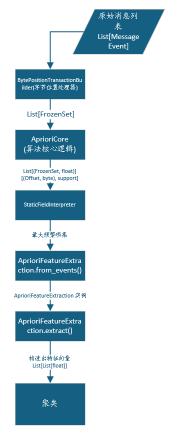

# Apriori分析器

在整个自动机系统构建过程可以多次出现以处理不同阶段的不同数据

思想就是**如果一件事很少出现，那它的组合就更少出现**, 就是逐渐增加集合的大小, 根据其出现的频率每次迭代淘汰小的(这也是剪枝的过程)

## 静态字段分析

协议关键词通常出现在固定位置, 利用Apriori算法的流程进行处理即可得到较为准确的聚类特征

### 流程



### 模块

#### `BytePositionTransactionBuilder`

**作用**：把原始字节消息转为 Apriori 能处理的事务格式。

Apriori 核心层只认识 `FrozenSet`，不认识 `MessageEvent`，这个模块负责把两者之间的格式转换。取消息前 `max_positions` 个字节，每个字节编码为 `(偏移, 值)` 元组，整条消息变成一个项集。

```
输入：MessageEvent（原始字节）
输出：FrozenSet{(0,0x00),(2,0x00),(7,0x03),...}
```

#### `AprioriCore`

**作用**：纯算法层，发现哪些字节组合在消息中频繁共现。

此层可以复用在多数符合条件的场景.

逐层扩展频繁项集：先找频繁单项，再找频繁二项组合，以此类推。利用 Apriori 剪枝性质（非频繁项集的超集必然非频繁）避免枚举所有组合。完全不知道业务含义，只处理 `FrozenSet`。

```
输入：List[FrozenSet]（事务集合）+ min_support
输出：List[(FrozenSet, support)]（所有频繁项集及其支持度）
```

#### `StaticFieldInterpreter`

**作用**：从频繁项集中**过滤噪声**，提取真正有区分价值的字节组合。

两步过滤：第一步去掉全局静态字段（`support ≥ 0.95` 的单项集，如 `protocol_id=0`，在所有消息里都有，无区分能力）；第二步取最大频繁项集，压缩结果数量，保留最完整的字节组合模式。

```
输入：List[(FrozenSet, support)]（所有频繁项集）
输出：List[(FrozenSet, support)]（过滤后的最大频繁项集）
```

#### `StaticFieldMiner`

**作用**：编排以上三个模块，对外提供统一的挖掘入口, 也就是一个小的pipeline

自身不实现任何算法，只负责按顺序调用 `builder.build()` → `core.frequent_itemsets()` → `interpreter.interpret()`，同时处理 `DictTransactionBuilder` 需要先 `fit` 的细节。

```
输入：List[MessageEvent]
输出：List[(FrozenSet, support)]（消息类型的字节指纹）
```

#### `AprioriFeatureExtraction.from_events`

**作用**：从挖掘结果中提炼出聚类所需的配置信息，构造特征提取器实例。

从最大频繁项集里提取两类信息：有区分价值的偏移位置（`positions`，按出现次数排序截断）和消息类型指纹（`itemsets`，按支持度排序截断）。同时计算归一化所需的 `max_payload_len`。

```
输入：List[MessageEvent]（全量数据）
输出：AprioriFeatureExtraction 实例（配置好 positions/itemsets/max_payload_len）
```

#### `AprioriFeatureExtraction.extract`

**作用**：把每条消息转为聚类算法能直接使用的数值特征向量。

四部分拼接：偏移字节值（体现关键位置的具体值）+ 项集匹配 one-hot（体现消息类型身份，加权放大）+ 归一化长度 + 方向。向量的每一维都在 `[0, onehot_weight]` 范围内，量纲统一。

```
输入：List[MessageEvent]
输出：List[List[float]]（每条消息对应一个特征向量）
```

### 关于全局静态字段的处理

对于fsm阶段的聚类特征向量, 考虑全局静态字段(表现为常数)就不合理, 因为它没有任何的区分性, 加入它会引入噪声, 降低聚类的效果, 所以需要对其进行过滤.

对于EFSM 的guard学习就很重要, 因为它可以作为constant类型变量的来源. 可以在fsm阶段的Apriori算法中虽然过滤其作为特征向量, 但是可以保留此内容作为后续步骤的信息.

## [guard学习器](..\..\protocol_infer\algorithm\guard_action\apriori_guard.py)

#### 流程

#### 变量类型推断

```txt
唯一值 = 1                → constant    e.g. [3,3,3,3]
唯一值 ≤ discrete_threshold → discrete  e.g. [3,16,3,16]
等步长序列                 → sequential  e.g. [1,2,3,4]
其他                      → continuous  e.g. [1.2,3.7,8.9]
```

#### Guard学习

- 单变量约束

  每种类型生成对应的约束形式

- Apriori 联合规则

  单变量约束只能孤立检查每个字段，无法发现字段间的条件依赖

  continuous类型变量需要**均值二值化**: 即高于均值的值设为1, 否则设置为0, 这样减少值域数量, 便于挖掘规则

  最终得到A--conf-->B的结果

- 连续变量线性关系

  对 `continuous` 类型的变量对，补充检测线性不变量, 这里借用了Daikon的函数拟合思想

  Daikon算法是**动态不变量检测器**, 观察程序执行过程中变量的值, 记录每次执行时变量的具体取值, 然后归纳不变量(即在所有执行中都成立的属性, 如常量关系, 线性关系, 范围关系, 排序关系)

  - `detect_pairwise`  检测a = k*b + c, 最小二乘法

  - `detect_triplet_sum`: 检测a+b = c

    适配工业协议中常见的字段拆分场景，例如 `high_byte + low_byte ≈ total`

#### Action学习

按**变量类型**决定更新策略

- constant   → keep       

  不更新，值恒定(keep)

- sequential → delta +1   

  固定步长递增

- discrete   → keep       

  离散跳变无法预测，**不更新**(keep)

- continuous → delta 或 keep

  -  |avg_delta| < delta_tolerance → keep
  -  |avg_delta| < delta_tolerance → delta avg_delta


