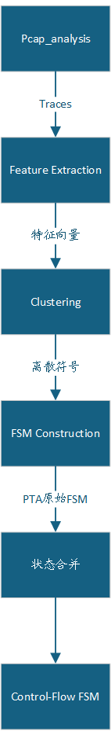

# 控制流构建层(fsm构建)

## 总体流程

## 特征提取

将`pcap_layer`的`traces`经过特征提取转为特征向量(使用float二维数组表示)

目前采用的特征主要有:

- 报文长度
- 端口号
- 初步得到发送的方向(即根据端口号得到谁发给谁)

这些都可以直接从包中直接获得, 为粗粒度级别特征

## 聚类

抽象基类定义: `protocol_infer.core.algorithm.clustering`

必须实现的方法有:

- `fit`
- `predict`

目前采用的方法为:

- 基于规则聚类
  - 每个完全相同的向量获得同一个簇ID(最初版本)

- K-means
- 层次聚类

## fsm构建

根据聚类得到的离散符号构建fsm, 可采用多种策略构建

可采用的构建方法:

- PAT

## 合并状态

根据构建的fsm, 通过合并算法对状态进行合并

采用的合并算法:

- K-tail