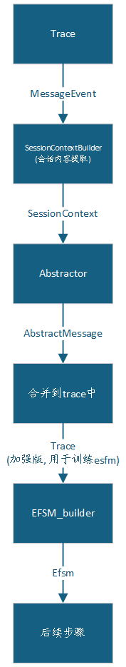

# 数据流层次设计(EFSM构建)

## 总体流程



## 设计思路

### 得到会话上下文

首先得到`SessionContext`, 即记录会话特征的容器, 其数据结构为:

```python
@dataclass
class SessionContext:

    # 方向判定变量
    is_client: bool = False
    server_port: int = 0
    
    # 统计变量
    packet_ratio: float = 0.0  # C2S / S2C 报文比例
    byte_ratio: float = 0.0    # C2S / S2C 字节比例
    pair_ratio: float = 0.0    # 请求-响应配对比例
    
    # 协议特征
    avg_message_len: float = 0.0
    message_len_std: float = 0.0
    total_messages: int = 0
    
    # 时序特征
    avg_interval: float = 0.0
    burstiness: float = 0.0
    
    # 协议指纹
    is_request_response: bool = False
    is_streaming: bool = False
    suspected_protocol: str = ""
```

#### 统计变量

- `packet_ratio`:

  客户端**发包数** / 服务器发包数, 如http中总是请求短, 响应的长, 则此时<1

- `byte_ratio`:

  客户端**字节数** / 服务器字节数

- `pair_ratio`:

  请求-响应成功配对比例, 如高的则为典型的请求-响应协议, 低则为流式协议

#### 构建方法

`self.feature_processor.build_session_contexts(trace, sessions)`

得到的效果如下:

```txt
trace.session_contexts = {
    SessionKey(src_ip='192.168.1.100', src_port=54321, dst_ip='192.168.1.100', dst_port=21, protocol='TCP'): {
        'is_client': True,
        'server_port': 21,
        'packet_ratio': 4/4 = 1.0,
        'byte_ratio': 150/120 = 1.25,
        'avg_message_len': 33.75,
        'message_len_std': 15.2,
        'avg_interval': 0.5,
        'burstiness': 1.2,
        'is_request_response': True,
        'is_streaming': False,
        'suspected_protocol': 'FTP'
    },
    .....
```

### 抽象消息

通过复用控制流处理时生成的symbol(或重新计算), 利用控制流之前学习好的abstractor(即聚类模型, 存储了特征向量->symbol)可以保证此时构建的efsm与原先的fsm的symbol保持一致, 构建`AbstractMessage`, 并且在其之中加入变量(`vars`成员), 为后续的guard学习做准备.

这步会在trace中添加`abstract_messages`成员

## efsm推断

在由fsm构建efsm之前, 需要对fsm进行确定化, 即将NFM转为DFM

**从有限状态机（FSM）+ 会话变量数据，推断出扩展有限状态机（EFSM）**，并为每个转移附加 guard（守卫条件）和 action（动作函数）

### 学习器选择

默认选择区间约束, 即`IntervalDeltaLearner()`

