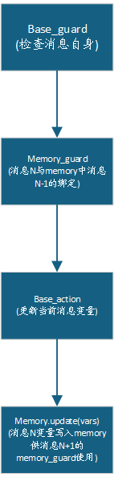
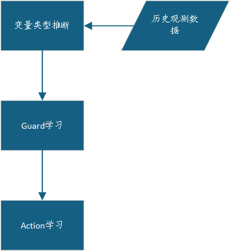
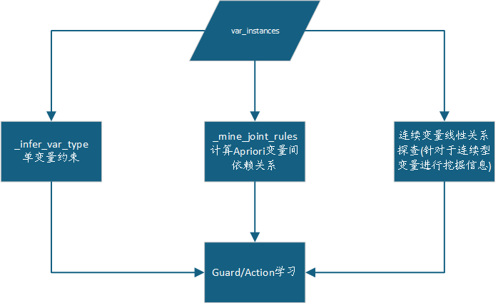

# 数据流层次设计(EFSM构建)

## 总体流程


## 设计思路

### 得到会话上下文

首先得到`SessionContext`, 即记录会话特征的容器, 其数据结构为:

```python
@dataclass
class SessionContext:

    # 方向判定变量
    is_client: bool = False
    server_port: int = 0
    
    # 统计变量
    packet_ratio: float = 0.0  # C2S / S2C 报文比例
    byte_ratio: float = 0.0    # C2S / S2C 字节比例
    pair_ratio: float = 0.0    # 请求-响应配对比例
    
    # 协议特征
    avg_message_len: float = 0.0
    message_len_std: float = 0.0
    total_messages: int = 0
    
    # 时序特征
    avg_interval: float = 0.0
    burstiness: float = 0.0
    
    # 协议指纹
    is_request_response: bool = False
    is_streaming: bool = False
    suspected_protocol: str = ""
```

#### 统计变量

- `packet_ratio`:

  客户端**发包数** / 服务器发包数, 如http中总是请求短, 响应的长, 则此时<1

- `byte_ratio`:

  客户端**字节数** / 服务器字节数

- `pair_ratio`:

  请求-响应成功配对比例, 如高的则为典型的请求-响应协议, 低则为流式协议

#### 构建方法

`self.feature_processor.build_session_contexts(trace, sessions)`

得到的效果如下:

```txt
trace.session_contexts = {
    SessionKey(src_ip='192.168.1.100', src_port=54321, dst_ip='192.168.1.100', dst_port=21, protocol='TCP'): {
        'is_client': True,
        'server_port': 21,
        'packet_ratio': 4/4 = 1.0,
        'byte_ratio': 150/120 = 1.25,
        'avg_message_len': 33.75,
        'message_len_std': 15.2,
        'avg_interval': 0.5,
        'burstiness': 1.2,
        'is_request_response': True,
        'is_streaming': False,
        'suspected_protocol': 'FTP'
    },
    .....
```

### 抽象消息

通过复用控制流处理时生成的symbol(或重新计算), 利用控制流之前学习好的abstractor(即聚类模型, 存储了特征向量->symbol)可以保证此时构建的efsm与原先的fsm的symbol保持一致, 构建`AbstractMessage`, 并且在其之中加入变量(`vars`成员), 为后续的guard学习做准备.

这步会在trace中添加`abstract_messages`成员

## efsm推断

在由fsm构建efsm之前, 需要对fsm进行确定化, 即将NFM转为DFM

**从有限状态机（FSM）+ 会话变量数据，推断出扩展有限状态机（EFSM）**，并为每个转移附加 guard（守卫条件）和 action（动作函数）



### 学习器选择

默认选择区间约束, 即`IntervalDeltaLearner()`

但是存在问题:

- guard区间宽
- action平均增量不准确

采用的改进方法就是使用[Apriori算法进行重构学习器](..\..\protocol_infer\algorithm\guard_action\apriori_guard.py)

## 针对于工控协议的设计

### 协议特点

- 会话短, 字段少
- 字段语义规律性强
- 请求响应严格配对
- 字段结构固定
- 单主站轮询为主

### 字段边界识别

原本的Refsm选用的字段边界识别方法是`Needleman-Wunsc`算法, 而此算法的问题就是粒度是单字节, 有些工控协议的字段长度可能为$2^n$个字节, 这种算法不仅复杂, 而且会漏掉一些长度大于1的字段信息.

如果使用Apriori算法, 虽然也会有仅考虑单字节的问题, 但是它的实现较为简单, 更适合前期的特殊字段值特征信息聚类, 而对于后续的构建efsm时的guard学习显得精度不足, 所以采用的方法是:

[固定偏移 + 多字节解析](./control_flow_layer.md)

### guard学习器

Refsm采用的是Daikon算法, Daikon算法的特点是:

- 从程序执行轨迹中推断变量间的**数值不变量**（如 `x == y`、`x <= y+1`、`x = 2*y + 3` 等线性关系）

- 使用预定义的**谓词模板库**进行穷举匹配

- 擅长发现**跨变量的线性数值关系**

对于工控协议, 工业协议字段天然是离散枚举 + 少量连续值的混合, DaiKon 对离散字段容易生成过宽的线性区间（欠拟合）

可以继续使用Apriori算法(改进版)进行此工作, 具体见[这个](./apriori.md)

采用的流程是:



Apriori算法运用到guard学习中:



update:

- 关于单变量约束:

  - `_GUARD_SKIP_VARS = {"direction", "entropy", "len"}`

    - direction: 对给定转移始终恒定, 生成约束无意义
    - entropy: 仅仅是一个payload字节的多样性的统计参数, 并非规范的字段, 学习后会过拟合
    - len: 包总字节数, 并非独立语义, 可能某次就是携带很大的数据

  - `MIN_CONFIDENCE = 6`

    避免小样本情况下的偶然性, 并非真实的约束
    
     对 `constant` 和 `discrete` 类型增加最低样本量门槛，样本不足时退化为**不生成约束**

- 多变量约束:

  跳过Apriori的安全性检查
  
  由于Apriori算法产生的侯选数上限为$2^N$, 不控制变量个数以及每个变量的离散值, 贡献的离散值太多就直接内存爆炸(虽然实际上通过**剪枝策略**(非频繁子集的超集不可能是频繁项集) 会裁减掉大量候选), 但最坏情况就是枚举全部的指数级个.
  
  关于最坏情况:
  $$
  2^N - 1 = \sum_{k=1}^{N} C_{N}^{k}
  $$
  各轮枚举量:
  
  | 轮次 k | 候选项集大小 | 候选数量               | 含义       |
  | ------ | ------------ | ---------------------- | ---------- |
  | 1      | 1-itemset    | $C_{N}^{1} = N$        | 每个单项   |
  | 2      | 2-itemset    | $C_{N}^{2} = N(N-1)/2$ | 每对组合   |
  | 3      | 3-itemset    | $C_{N}^{3}$            | 每个三元组 |
  | ...    | ...          | ...                    | ...        |
  | N      | N-itemset    | $C_{N}^{N} = 1$        | 全集本身   |
  
  

### 内存设计

- 只需保存最近一条请求的字段，不需要长历史

  对应特点: 严格的请求-响应配对

- 不需要复杂的惰性清除机制, 全量存储所有字段的开销可以接受

  对应特点: 字段数量少且语义固定

跨消息变量关系:

- 恒等关系
- 序列递增
- 线性关系

## TODO list

- ~~用 Apriori 挖掘了变量间的关联规则, 但未处理**消息间**的依赖关系~~

- ~~未实现**跨消息**的内存推断~~

  ~~`EFSMInferencer` 的 `sequences` 只是 `(symbol, vars)` 的列表，没有跨消息的内存机制，`action` 也只是更新当前变量，无法把值传递给下一条消息~~

- Apriori算法可能导致内存爆炸的问题, 对于字段较多的协议可能较为吃力, 后续可以改进为FP-Growth算法, 或者可以更改更加动态的方法: 即根据min_support来决定选用什么算法(如果min_support较大, 则适合采用Apriori算法) 并且Apriori算法的线性扫描在CPU缓存层面比FP-Tree的指针跳转更高效
  
  
